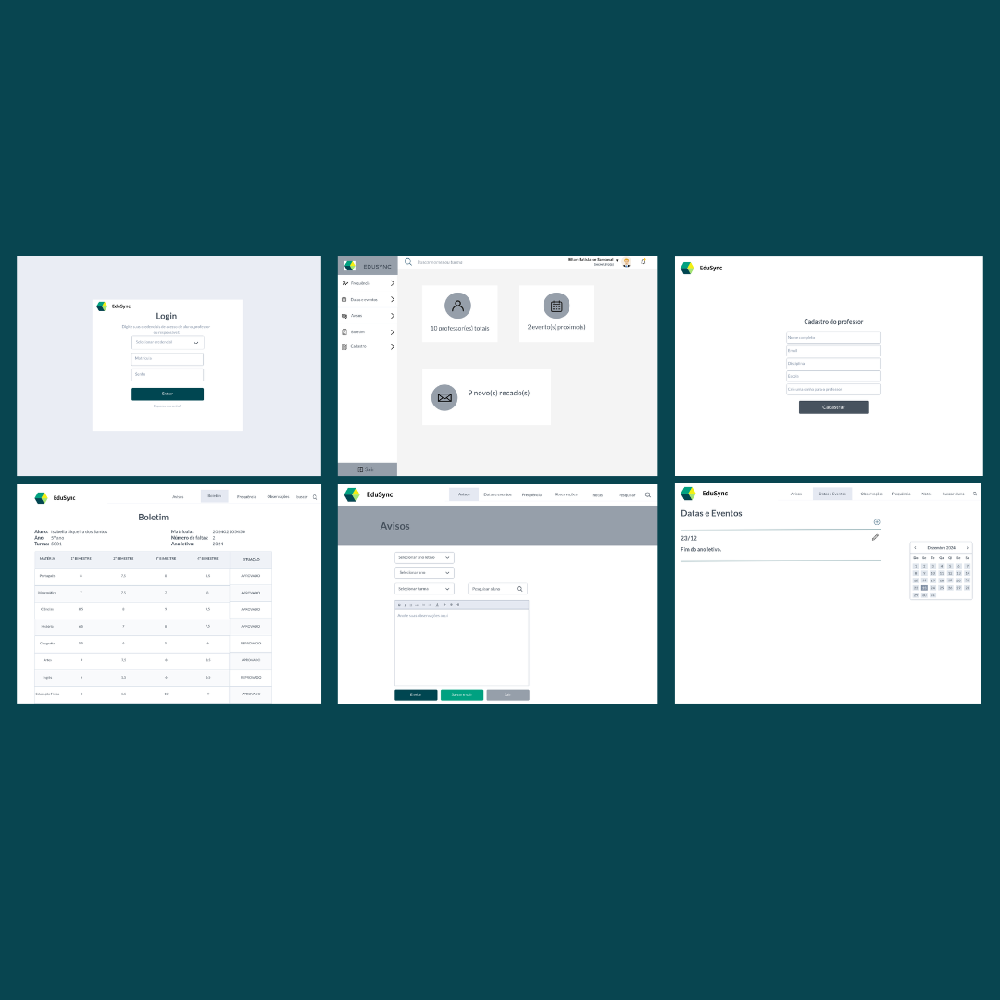
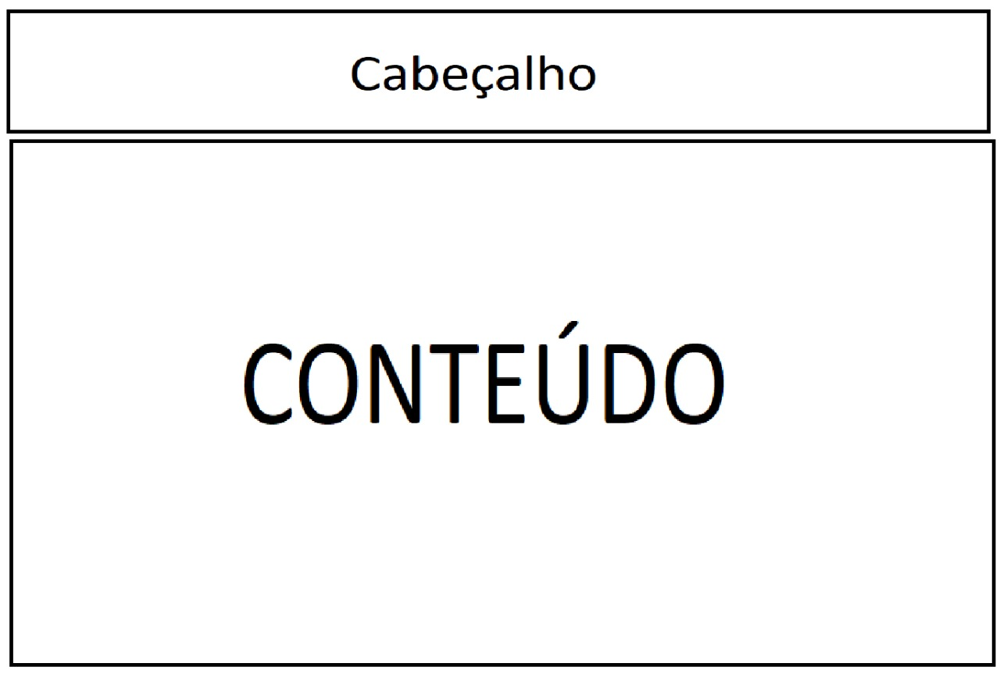
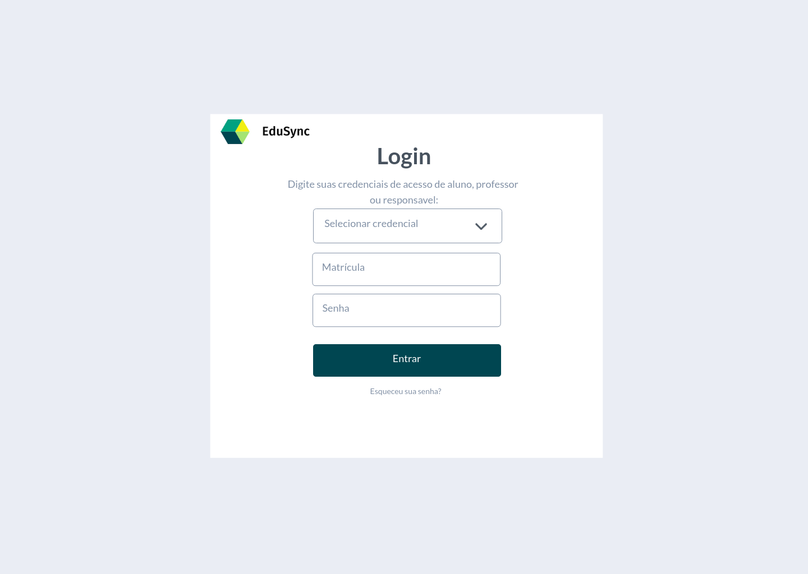
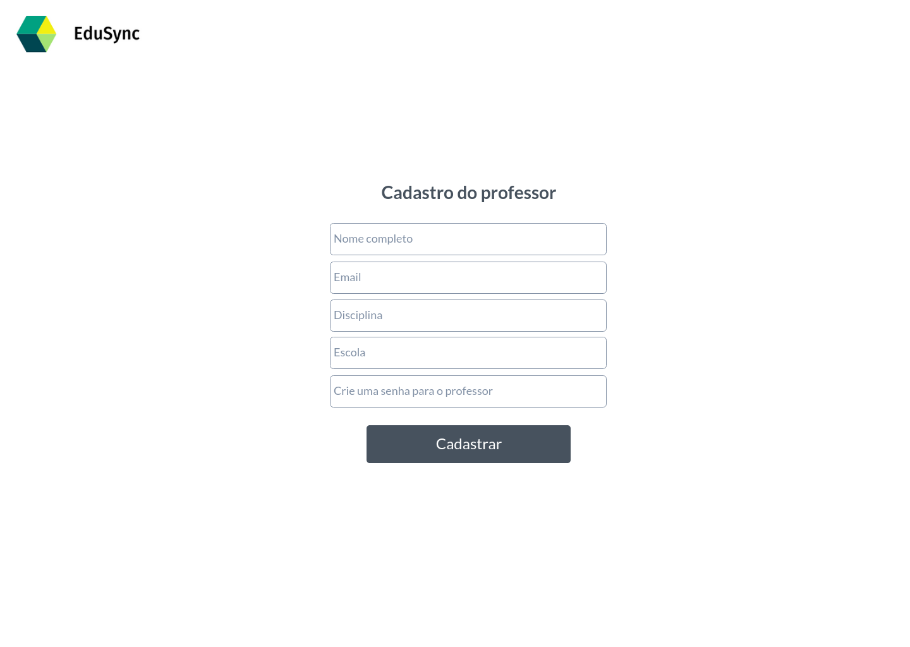
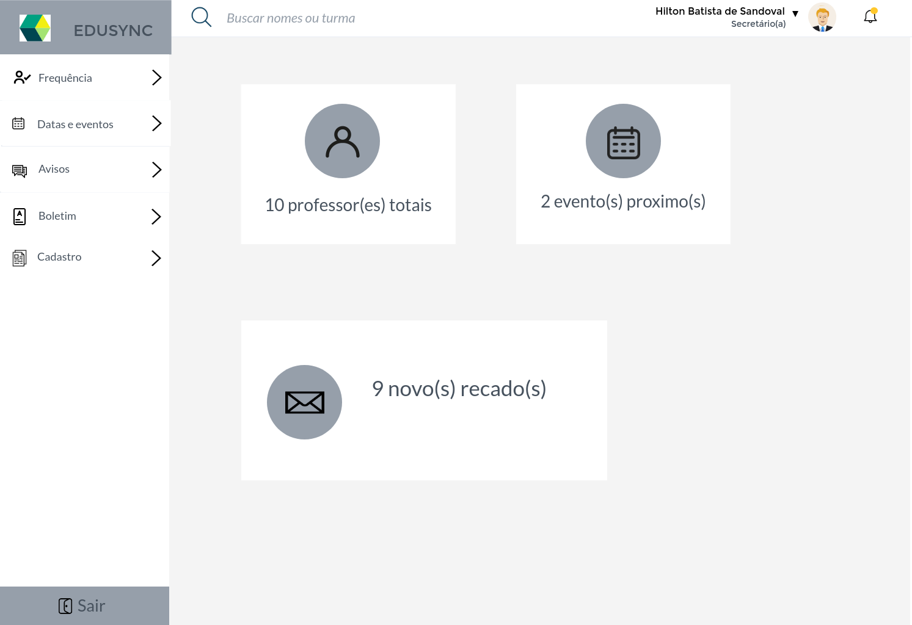
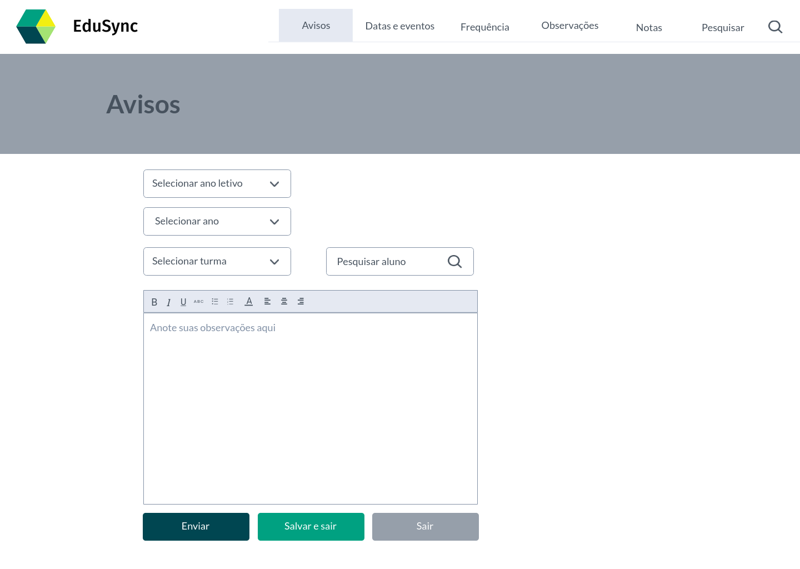

# Projeto de Interface

## User Flow

O fluxograma apresentado na figura 1 mostra o fluxo de interação do usuário pelas telas do sistema. Cada uma das telas deste fluxo é detalhada na seção de Protótipo de baixa fidelidade que se segue.

 

<figure> 
    <figcaption>Figura 1 - Fluxo de telas do usuário (secretário)
</figure> 

## Protótipo de baixa fidelidade

As telas do sistema apresentam uma estrutura comum que é apresentada na figura 2. Nesta estrutura existem 2 grandes blocos, descritos a seguir. São eles:
<ul>
  <li>Cabeçalho - local onde estão dispostos o nome da aplicação web e navegação principal do site (menu da aplicação);</li>
  <li>Conteúdo - apresenta o conteúdo da tela em questão;</li>
</ul> 

   
  <figure>
    <figcaption>Figura 2 - Estrutura padrão do site
  </figure>

  

<h3><b>Tela – Login</b></h3>

A tela de Login apresenta campos para a seleção da credencial e inserção da matrícula e da senha. 

  
  

<figure> 
    <figcaption>Figura 3 - Tela de acesso à conta do usuário
</figure>

<h3><b>Tela – Cadastro</b></h3>

A tela de cadastro apresenta os seguintes campos para a inserção das informações pessoais do usuário: Nome Completo, E-mail, Disciplina, Escola e Senha.

  
  

<figure> 
    <figcaption>Figura 4 - Tela de cadastro de usuários
</figure>

 

<h3><b>Tela - Home page</b></h3>

A tela de home page apresenta um menu e alguns banners como opções para o usuário selecionar. 

  

<figure> 
  <figcaption>Figura 5 - Tela home page
</figure> 

<h3><b>Tela - Avisos</b></h3>

A tela de avisos se destina a comunicação entre os usuários. 

  

<figure> 
  <figcaption>Figura 6 - Tela de comunicação
</figure> 

[Elabore as principais interfaces gráficas da aplicação de modo que os requisitos funcionais sejam contemplados nas telas propostas.]

[Adicione aqui as telas da sua aplicação com seus devidos títulos.] 
 
> **Links Úteis**:
> - [Protótipos vs Wireframes](https://www.nngroup.com/videos/prototypes-vs-wireframes-ux-projects/)
>- Ferramentas:
>> - [Pencil](https://pencil.evolus.vn/)
>> - [MarvelApp](https://marvelapp.com/)
>> - [Figma](https://www.figma.com/)

